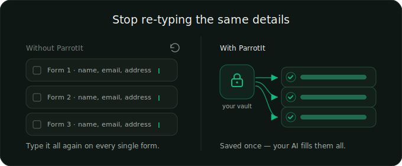
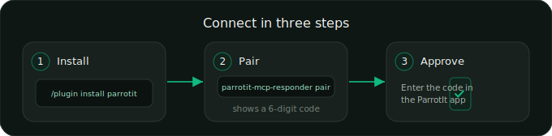

# ParrotIt — use AI with your data, safely

Connect a desktop AI assistant — Claude Code, Claude Desktop, Cursor, and others — to your **encrypted ParrotIt vault**. Your AI can read your saved details and fill them into forms for you — and save new ones back — **without ParrotIt ever seeing your data, and without you ever pasting the same details twice.**

Your values are decrypted **only on your own machine**. Every read and save is **logged** in the ParrotIt app, and you can **disconnect** the AI at any time.


---

## Install (Claude Code)

```
/plugin marketplace add woisme/parrotit
/plugin install parrotit
```

Then pair your device once (see [Set it up](#set-it-up) below). That's it — no config files to edit by hand.

> Using **Claude Desktop, Cursor, or another client** instead? The plugin install above is a Claude Code feature, but the same connector works everywhere. See [Other AI clients](#other-ai-clients).

---

## What this does

ParrotIt is a private vault for the details you get asked for over and over — names, contact details, dates, addresses, and so on. This plugin lets your AI assistant use that vault on your behalf:

- **Fill forms for you.** Ask your AI to complete a form and it pulls the right details from your vault — no copy-pasting.
- **Remember new answers.** When you tell your AI a new detail about yourself, it can save it back to your vault for next time.
- **Stay private.** The AI works with your data on your own computer. ParrotIt's servers only ever hold a scrambled, unreadable copy of your data plus the *names* of your fields — never the values.



---

## Before you connect — what this means

Connecting an AI to your vault is a real trade. Read this first.

- **The AI you connect — and its provider — will see whatever it reads.** When your AI pulls your email or address to fill a form, that value goes to your AI provider (Anthropic, OpenAI, …). That is the choice you are making by connecting it.
- **ParrotIt never sees your values.** Only this connector, running on your own machine, can unlock them. ParrotIt's servers hold only a scrambled, unreadable copy plus the field names — nothing they can read.
- **Every read and save is logged.** Open the ParrotIt app → **AI activity** to see one line per action, and **disconnect** any AI at any time.
- **Sensitive data is off by default.** Regulated IDs (NI, NHS, passport, driving licence, UTR, right-to-work) and special-category data (e.g. health) are **not released** to the AI unless you switch on *sensitive reads* for that connection — and even then, an AI can **never save** government IDs or health data; it can only ever propose other details for you to confirm.
- **Saving is off by default, too.** A freshly connected AI is **read-only**. To let it save new details, turn on **Allow saving** for it in the app.
- **The log is only as honest as the official connector.** It is recorded by the genuine `@parrotit/mcp-responder` connector. A different program could read an export of your data without showing up in the log — so only install the official one (this repo / the npm package), not a fork you don't trust.

Disconnecting stops *future* access. Anything already read is in your AI's context and can't be un-sent.

---

## What you need

- A **ParrotIt account** with the app installed ([parrotit.app](https://parrotit.app)). This plugin connects to your existing vault; it doesn't create one.
- A **desktop computer** (macOS, Windows, or Linux). The connector runs on your machine — it is not part of the phone app, and nothing runs in the cloud.
- **Node.js 20 or newer** — run `node --version` to check; install from [nodejs.org](https://nodejs.org) if you don't have it. (The connector runs via `npx`.)

---

## Set it up



**1. Install the plugin.** Run the two commands from [Install](#install-claude-code) above (if you haven't already). This wires up the connector automatically — there's no `claude_desktop_config.json` to edit by hand.

**2. Pair your device** (one time). In your terminal, run:

```
npx -y @parrotit/mcp-responder pair
```

It prints a **6-digit safety code**.

**3. Approve it in the ParrotIt app.** Open **My Devices → add a device**, enter the code, and approve. The connector securely stores its access key in your operating system's keychain (Keychain on macOS, Credential Manager on Windows). Nothing sensitive is written to a plain file.

**4. Restart Claude Code.** The ParrotIt tools now appear, and your AI can read your vault on demand.

**5. (Optional) Choose what it can do.** New connections are read-only and can't touch sensitive details. To let an AI read sensitive fields or save new answers, turn those on for it in the app under **AI activity**.

---

## What it can read and save

The connector mirrors ParrotIt's sensitivity tiers. The tier is decided by ParrotIt's servers, not the AI — the AI can only advise.

| Tier | What's in it | Read | Save |
|------|--------------|------|------|
| 1 — Public | Name, email, phone | Served | A tiny allowlist auto-saves; the rest wait for you to confirm |
| 2 — Private | Date of birth, address | Served | Saved as **pending** until you confirm in the app |
| 3 — Regulated | Income, bank details, gov IDs | **Refused unless you grant sensitive reads** | Pending; **government IDs are never saved** |
| 4 — Special category | Health conditions, medications | **Refused unless you grant sensitive reads** | **Never saved** |

- **Sensitive reads (tiers 3 & 4) are off by default**, per connection. The block is enforced by ParrotIt's servers — a forked connector can't fetch them either.
- **Saves land "pending"** by default. You review and confirm (or discard) them in the app under **AI activity**, so an AI can never silently rewrite your vault.

---

## The tools

Once paired, your AI has these tools:

| Tool | What it does |
|------|--------------|
| `get` | Fetch one value (e.g. your email). Requires a stated `purpose`, which is logged. |
| `get_many` | Fetch several values in one call. Also requires a `purpose`. |
| `list_keys` | List the fields you have, with labels and sensitivity tiers — never the values. |
| `search` | Match a description like *"home address"* to the right field. |
| `save` | Save a new detail you stated about yourself. Most saves land **pending** until you confirm. |

Every read and save writes exactly one line to your **AI activity** log. The `save` tool never echoes your value back.

---

## Manage & disconnect

Everything is controlled from the ParrotIt app under **AI activity**:

- **See every read and save** — one plain-English line per action.
- **Allow saving** — turn an individual AI's write access on or off.
- **Allow sensitive reads** — let a specific AI read tier-3/4 fields (off by default).
- **Review pending saves** — confirm or discard anything an AI proposed.
- **Disconnect** — revoke an AI in the app. It stops getting new data right away, and loses access completely within a short window after that.

---

## How it works

```
Your AI ──asks──▶ ParrotIt connector (on your computer) ──▶ encrypted vault
                          │
                  decrypts the value locally with a key in your OS keychain
                          │
                          ▼
              returns the value to your AI   +   logs the read in "AI activity"
```

- The connector enrols as **just another linked ParrotIt device**, with its own keys.
- It pulls your **encrypted** vault and decrypts each value **on demand, in memory, on your machine**. Nothing is cached to disk or logged.
- ParrotIt's servers only ever store ciphertext and the *names* of your fields.

---

## Other AI clients

The `/plugin` command is specific to **Claude Code**. The connector itself is client-agnostic and works with **Claude Desktop, Cursor, openclaw, Windsurf, Cline, Zed**, and any other MCP client. For those, install the connector directly and add it to that client's MCP config:

```bash
npm install -g @parrotit/mcp-responder
parrotit-mcp-responder pair
```

Then add this to the client's MCP config (e.g. Claude Desktop's `claude_desktop_config.json`):

```jsonc
{
  "mcpServers": {
    "parrotit": {
      "command": "npx",
      "args": ["-y", "@parrotit/mcp-responder"],
      "env": { "PARROTIT_CLIENT_FAMILY": "claude-desktop" }
    }
  }
}
```

Full connector docs: [`@parrotit/mcp-responder` on npm](https://www.npmjs.com/package/@parrotit/mcp-responder).

---

## Troubleshooting

- **The tools don't appear.** Make sure you ran the `pair` step and approved the device in the app, then restart Claude Code (or run `/reload-plugins`).
- **"Pairing expired."** The safety code is short-lived. Run `npx -y @parrotit/mcp-responder pair` again and approve promptly.
- **An AI can't read a sensitive field.** That's by design — turn on **Allow sensitive reads** for that connection in the app under **AI activity**.
- **A save didn't stick.** Saves land **pending**. Confirm it in the app under **AI activity**.

---

## Our promises, in one place

1. **ParrotIt operators cannot read your vault** — values are decrypted only on your device.
2. **You can see every read and save** — the AI activity log in the app.
3. **You can revoke** — disconnect a connector in the app; past reads can't be retracted, but future access stops.
4. **No login for the connector** — your identity is anchored in your enrolled devices; this connector is one of them.

---

## Links

- ParrotIt: [parrotit.app](https://parrotit.app)
- Connect-an-AI guide: [parrotit.app/connect-ai](https://parrotit.app/connect-ai)
- The connector: [`@parrotit/mcp-responder`](https://www.npmjs.com/package/@parrotit/mcp-responder)

## License

[MIT](./LICENSE)
